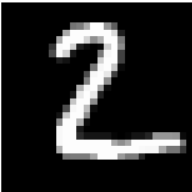

# Handwritten Digit Recognition using Neural Networks
This repository contains a Python implementation of a Handwritten Digit Recognition System using the MNIST dataset and a Neural Network. The goal of this project is to build a model that can accurately identify handwritten digits from 0 to 9.

Overview
Handwritten digit recognition is a classic problem in the field of computer vision and machine learning. The MNIST dataset is widely used as a benchmark for this task. It consists of 70,000 images of handwritten digits, each of size 28x28 pixels.

In this project, we use TensorFlow to build a Convolutional Neural Network (CNN) model for handwritten digit recognition. The CNN architecture is well-suited for image-based tasks and has shown excellent performance on the MNIST dataset.

Requirements
To run the code in this repository, you need the following libraries:

TensorFlow
NumPy
Matplotlib
You can install them using the following command:

Copy code
pip install tensorflow numpy matplotlib
Usage
Clone this repository to your local machine.

Open a Jupyter Notebook and navigate to the cloned repository.

Run the Jupyter Notebook Handwritten_Digit_Recognition.ipynb cell by cell to execute the code.

The notebook will load the MNIST dataset, build and train the CNN model, and evaluate its performance.

After training, the model's accuracy on the test set will be displayed.

You can also test the model with your own handwritten digits or random samples from the test set.

Results
The trained CNN model achieves a high accuracy on the test set, showcasing its effectiveness in recognizing handwritten digits. You can also visualize the training and validation accuracy over epochs using the plotted graph.

Examples
Here are some examples of the model's predictions on random samples from the test set:

Example 1

Example 2

Contributing
Contributions to this project are welcome. If you find any issues or have suggestions for improvement, please feel free to create a pull request.

Credits
The implementation in this repository is based on the guidance provided by the OpenAI GPT-3.5 language model.

The MNIST dataset is a widely-used benchmark for handwritten digit recognition, and it is available through TensorFlow's dataset library.

License
This project is licensed under the MIT License.

Replace the [LICENSE] link in the above write-up with a direct link to your LICENSE file.

Make sure to add any relevant images to the images folder in your repository and update the image paths in the write-up accordingly.

With this write-up, users visiting your GitHub repository will have a clear understanding of the project, its purpose, and how to run the code.
